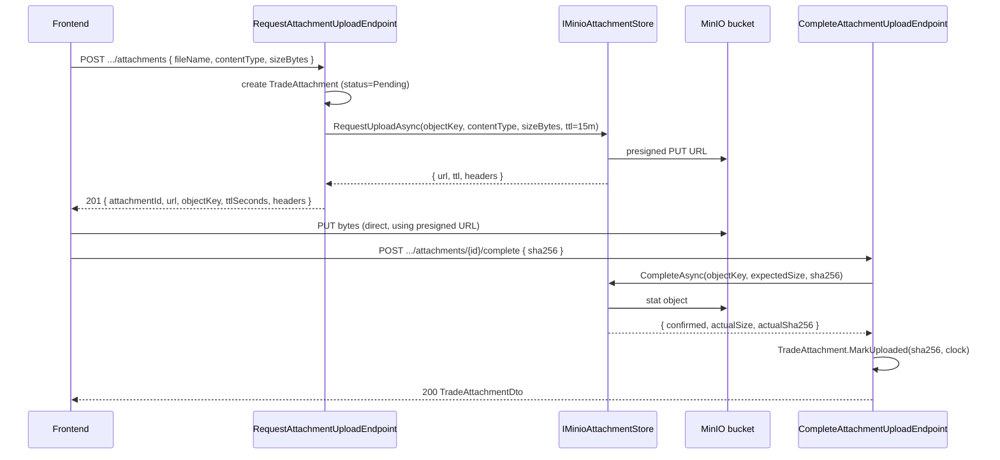

# Design: Trader Risk & Journal Core — Wave 1

## Technical Approach

Wave 1 ships six additive slices into the existing .NET 10 modular monolith: one new Identity aggregate (`RiskProfile`), four new Trading aggregates (`PreTradeChecklist`, `TradeReview`, `TradeAttachment`, the metrics read model), one shared infrastructure client (`MinioClient`), and one integration-test surface. The dependency direction stays clean: Trading reads Identity through a narrow projection in `JadeCapital.Identity.Contracts.Projections` (same pattern Wave 0 used for `IUserOwnerProjection`); Shared.Infrastructure exposes `IMinioAttachmentStore` so neither Trading nor Identity take a hard dependency on the MinIO SDK.

The `Trade` aggregate is **not** extended. `OpenTrade` becomes a factory composition: the handler accepts an optional `PreTradeChecklistSubmission?`, validates it through a separate domain call, and persists the trade + checklist in one Unit-of-Work transaction. Closed trades stay unchanged; review is an aggregate of its own keyed on `trade_id`.

All migrations are additive, nullable, `IF NOT EXISTS`. Metrics read from existing `trading.trades` columns and the new `trading.pre_trade_checklists` table — no `trading.trades` schema change is required for metrics.

## Architecture Decisions

### Decision: Single-active risk profile enforced at the database

**Choice**: A partial unique index `WHERE is_active` on `identity.risk_profiles(user_id)` enforces "exactly one active profile per user" at the DB layer.
**Alternatives considered**: Application-level lock; serializable transaction with explicit `SELECT … FOR UPDATE`.
**Rationale**: The DB index is the cheapest, most correct guard against concurrent supersede. Application-level locks add complexity without buying anything the index already gives us for free.

### Decision: Checklist as optional `OpenTrade` parameter, not a new endpoint

**Choice**: `OpenTradeCommand` gains an optional `PreTradeChecklistSubmission?` field.
**Alternatives**: `POST /api/trades/{id}/checklist` after the trade is opened; two-step flow.
**Rationale**: Atomicity. If the checklist fails we MUST NOT persist the trade; a post-hoc endpoint would race with close/delete and force compensation. Adding an optional field to an existing command is backward-compatible: callers that omit it keep the legacy semantics.

### Decision: Position-size calculator is informational, not enforced

**Choice**: `GET /api/position-size?symbol=&entryPrice=&stopPrice=&riskPerTradePercentOverride?` returns a number; nothing reads it back to gate `OpenTrade`.
**Alternatives**: Pass the calculated volume into `OpenTradeCommand`; reject OpenTrade when volume diverges.
**Rationale**: The user requested "RiskPerTrade override per-trade, not persistent". The calculator must remain advisory so the user can still take discretionary overrides without the server second-guessing them. The pre-trade checklist still gates via the user's chosen fields.

### Decision: MinIO via presigned URL, backend never proxies bytes

**Choice**: `IMinioAttachmentStore.RequestUploadAsync(...)` returns a presigned PUT URL; the client uploads directly to MinIO; `CompleteAsync(attachmentId, sha256)` confirms the upload.
**Alternatives**: Backend proxy endpoint that accepts `multipart/form-data`.
**Rationale**: Avoids double bandwidth (client → backend → MinIO) and keeps the .NET host stateless w.r.t. attachment bytes. Direct upload also gives the client upload progress for free.

### Decision: `IMinioAttachmentStore` as the only MinIO coupling

**Choice**: The `MinioClient` is instantiated inside `Shared.Infrastructure.DependencyInjection.AddMinioInfrastructure(...)` and only `IMinioAttachmentStore` (an interface in `JadeCapital.Shared.Kernel.Storage`) is exposed.
**Alternatives**: Inject `MinioClient` directly into Trading handlers.
**Rationale**: Same isolation Wave 0 used for `IEmailSender`. Tests can stub the store with an in-memory fake (no MinIO container needed for unit tests). MinIO is only required for the integration tests in `1e`.

### Decision: Cross-module RiskProfile read via narrow projection

**Choice**: `IIdentityUserRiskProfileReader` defined in `JadeCapital.Identity.Contracts.Projections` exposes only `CapitalAmount`, `CapitalCurrency`, `RiskPerTradePercent`, `RiskRewardTarget`. Implementation lives in `JadeCapital.Identity.Infrastructure`.
**Alternatives**: Trading depends on `JadeCapital.Identity.Domain`; Trading duplicates the risk-profile table; an event-driven projection.
**Rationale**: This is the Wave 0 pattern (`IUserOwnerProjection`). Read-through is the simplest correct choice for a v1 and avoids a duplicate table or async eventual-consistency story. Events are still emitted for downstream consumers (future Strategy/Alert slices).

### Decision: Money invariants stay NUMERIC(24,8)

**Choice**: All monetary fields (`volume`, `entryPrice`, `pnl`, `capitalAmount`) use `decimal` with `NUMERIC(24,8)`. `Money.MaxAmount = 10^16` is enforced at the domain boundary.
**Rationale**: Matches the existing `Money` VO contract in `JadeCapital.Shared.Kernel`. The position-size formula uses `decimal` end-to-end and rejects inputs that would overflow.

### Decision: Metrics computed on read, not stored

**Choice**: `GET /api/trades/metrics` queries `trading.trades` directly per request, scoped by `user_id` and `opened_at >= now - period`.
**Alternatives**: Materialized view refreshed nightly; per-user cached projection updated on `TradeClosedDomainEvent`.
**Rationale**: The dataset is per-user, indexed by `ix_trades_user_opened_at` (already exists from migration `0002`), bounded by the user's own history. A materialized view adds staleness for a query that already runs in <50 ms with the existing index. We can promote to a cached projection in Wave 2 if power users show >1 s responses.

## New Aggregates

### Identity.Domain — `RiskProfile`

```text
RiskProfile : AggregateRoot<Guid>
  UserId            : Guid       (FK identity.users)
  CapitalAmount     : decimal    (NUMERIC(24,8), > 0)
  CapitalCurrency   : Currency   (3-letter ISO 4217-like)
  MaxDrawdownPercent: decimal    (0.00–50.00)
  RiskPerTradePercent: decimal   (0.01–5.00)
  RiskRewardTarget  : decimal    (≥ 1.0)
  IsActive          : bool
  SupersededAt      : DateTimeOffset?
  CreatedAt         : DateTimeOffset
```

Factory: `RiskProfile.Create(id, userId, capital, drawdown, riskPerTrade, rrTarget, clock)` — returns `Result<RiskProfile>`. Supersede: `current.MarkSuperseded(clock)` then `RiskProfile.Create(...)` in the same UoW.

Value objects:
- `RiskPerTradePercent` — decimal `[0.01, 5.00]`, factory `Create(decimal)`.
- `MaxDrawdownPercent` — decimal `[0.00, 50.00]`.
- `RiskRewardRatio` — decimal `≥ 1.0`.

Domain event: `RiskProfileUpdatedDomainEvent { UserId, RiskProfileId, CapitalAmount, CapitalCurrency, RiskPerTradePercent, RiskRewardTarget, OccurredAt }`.

### Trading.Domain — `PreTradeChecklist`

```text
PreTradeChecklist : AggregateRoot<Guid>
  TradeId                : Guid       (FK trading.trades)
  UserId                 : Guid       (FK identity.users)
  SubmittedAt            : DateTimeOffset
  Emotionality           : enum       (Calm | Anxious | Neutral | Excited | Tilted)
  SetupQuality           : enum       (A | B | C | D)
  RiskRewardAtEntry      : decimal
  RiskRewardTargetUsed   : decimal    (1.0 if no active profile)
  ConfluencesCount       : int        (1..10)
```

Factory: `PreTradeChecklist.Submit(id, tradeId, userId, submission, targetUsed, clock)`. Validation: enum membership, `confluencesCount ∈ [1, 10]`, `riskRewardAtEntry ≥ riskRewardTargetUsed`.

Domain event: `PreTradeChecklistSubmittedDomainEvent { TradeId, UserId, Emotionality, SetupQuality, RiskRewardAtEntry, RiskRewardTargetUsed, ConfluencesCount, HadActiveProfile, OccurredAt }`.

### Trading.Domain — `TradeReview`

```text
TradeReview : AggregateRoot<Guid>
  TradeId        : Guid        (FK trading.trades)
  UserId         : Guid        (FK identity.users)
  Emotionality   : enum        (Confident | Calm | Anxious | Neutral | Tilted | Frustrated)
  Setup          : string      (≤ 80, trimmed)
  Lessons        : string      (≤ 2000)
  Rating         : int?        (1..5)
  CreatedAt      : DateTimeOffset
  UpdatedAt      : DateTimeOffset?
```

Factory: `TradeReview.Create(id, tradeId, userId, submission, clock)` — returns `Result<TradeReview>` (rejects when trade is Open/Cancelled or already reviewed). Mutator: `Update(submission, clock)`.

Domain event: `TradeReviewCreatedDomainEvent { TradeId, UserId, ReviewId, OccurredAt }`.

### Trading.Domain — `TradeAttachment`

```text
TradeAttachment : AggregateRoot<Guid>
  ReviewId     : Guid
  UserId       : Guid
  ObjectKey    : string         (e.g. trading/attachments/{userId}/{tradeId}/{id}/{fileName})
  ContentType  : string         (RFC 6838)
  SizeBytes    : long           (> 0)
  Sha256       : string         (64 hex chars)
  Status       : enum           (Pending | Uploaded | Failed)
  CreatedAt    : DateTimeOffset
  UploadedAt   : DateTimeOffset?
```

Factory: `TradeAttachment.RequestSlot(id, reviewId, userId, fileName, contentType, sizeBytes, clock)` — pending row. `MarkUploaded(sha256, clock)` — only after `IMinioAttachmentStore.CompleteAsync` confirms.

Domain event: `TradeAttachmentUploadedDomainEvent { TradeId, ReviewId, AttachmentId, SizeBytes, ContentType, OccurredAt }` (no `objectKey` or `sha256` in the event body; consumers query the aggregate).

## Data Flow

### OpenTrade with checklist

```text
POST /api/trades (with checklist)
   │
   ▼
OpenTradeHandler
   │  1. Read active risk profile via IIdentityUserRiskProfileReader
   │  2. Build PreTradeChecklist aggregate (validates fields)
   │  3. Call Trade.Open(...) → Result<Trade>
   │  4. trades.AddAsync(trade); checklists.AddAsync(checklist)
   │  5. uow.SaveChangesAsync (one transaction)
   ▼
Returns 201 with TradeDto
```

### Position-size calculator

```text
GET /api/position-size?symbol=EURUSD&entryPrice=1.1000&stopPrice=1.0950&riskPerTradePercentOverride=2.0
   │
   ▼
CalculatePositionSizeHandler
   │  1. Resolve symbol → Instrument (decimalPlaces, contractSize)
   │  2. Read active risk profile (or 404)
   │  3. p = override ?? profile.RiskPerTradePercent
   │  4. distance = |entryPrice - stopPrice|  (in quote currency)
   │  5. volume = (capital × p / 100) / distance, round to decimalPlaces
   ▼
Returns 200 with PositionSizeDto
```

### Attachment upload (presigned URL)

```text
POST /api/trades/{id}/review/attachments { fileName, contentType, sizeBytes }
   │
   ▼
RequestAttachmentUploadHandler
   │  1. Resolve review (user-scoped)
   │  2. objectKey = "trading/attachments/{userId}/{tradeId}/{reviewId}/{attachmentId}/{fileName}"
   │  3. Create TradeAttachment row (status=Pending)
   │  4. IMinioAttachmentStore.RequestUploadAsync(objectKey, contentType, sizeBytes)
   │     → returns presigned URL + TTL
   ▼
Returns 201 with { attachmentId, presignedUrl, objectKey, ttlSeconds, headers }

[client uploads bytes directly to MinIO]

POST /api/trades/{id}/review/attachments/{attId}/complete { sha256 }
   │
   ▼
CompleteAttachmentHandler
   │  1. Resolve attachment (user-scoped; status=Pending)
   │  2. IMinioAttachmentStore.CompleteAsync(objectKey, sha256)
   │     → verifies object exists, size matches, sha256 matches
   │  3. MarkUploaded(sha256, clock)
   │  4. Raise TradeAttachmentUploadedDomainEvent
   ▼
Returns 200 with TradeAttachmentDto
```

## File Changes

### New files

| Path | Action | Description |
|---|---|---|
| `src/2.Modules/Identity/JadeCapital.Identity.Domain/RiskProfile/RiskProfile.cs` | Create | Aggregate root |
| `src/2.Modules/Identity/JadeCapital.Identity.Domain/RiskProfile/RiskPerTradePercent.cs` | Create | VO `[0.01, 5.00]` |
| `src/2.Modules/Identity/JadeCapital.Identity.Domain/RiskProfile/MaxDrawdownPercent.cs` | Create | VO `[0.00, 50.00]` |
| `src/2.Modules/Identity/JadeCapital.Identity.Domain/RiskProfile/RiskRewardRatio.cs` | Create | VO `≥ 1.0` |
| `src/2.Modules/Identity/JadeCapital.Identity.Domain/RiskProfile/RiskProfileErrors.cs` | Create | Domain errors |
| `src/2.Modules/Identity/JadeCapital.Identity.Domain/RiskProfile/Events/RiskProfileUpdatedDomainEvent.cs` | Create | Event |
| `src/2.Modules/Identity/JadeCapital.Identity.Application/Features/RiskProfile/CreateOrSupersedeRiskProfile/CreateOrSupersedeRiskProfileCommand.cs` | Create | MediatR command + validator |
| `src/2.Modules/Identity/JadeCapital.Identity.Application/Features/RiskProfile/CreateOrSupersedeRiskProfile/CreateOrSupersedeRiskProfileHandler.cs` | Create | MediatR handler |
| `src/2.Modules/Identity/JadeCapital.Identity.Application/Features/RiskProfile/GetActiveRiskProfile/GetActiveRiskProfileQuery.cs` | Create | MediatR query + handler |
| `src/2.Modules/Identity/JadeCapital.Identity.Application/Abstractions/IRiskProfileRepository.cs` | Create | Repository contract |
| `src/2.Modules/Identity/JadeCapital.Identity.Contracts/Projections/IIdentityUserRiskProfileReader.cs` | Create | Cross-module reader (4 properties) |
| `src/2.Modules/Identity/JadeCapital.Identity.Api/Endpoints/RiskProfileEndpoints.cs` | Create | `GET/PUT /api/risk-profile` |
| `src/2.Modules/Identity/JadeCapital.Identity.Infrastructure/Persistence/Configurations/RiskProfileConfiguration.cs` | Create | EF Core config + partial unique index |
| `src/2.Modules/Identity/JadeCapital.Identity.Infrastructure/Repositories/RiskProfileRepository.cs` | Create | EF repo |
| `src/2.Modules/Identity/JadeCapital.Identity.Infrastructure/Projections/IdentityUserRiskProfileReader.cs` | Create | Cross-module reader implementation |

| Path | Action | Description |
|---|---|---|
| `src/2.Modules/Trading/JadeCapital.Trading.Domain/Checklists/PreTradeChecklist.cs` | Create | Aggregate |
| `src/2.Modules/Trading/JadeCapital.Trading.Domain/Checklists/PreTradeChecklistSubmission.cs` | Create | Submission payload (DTO-friendly record) |
| `src/2.Modules/Trading/JadeCapital.Trading.Domain/Checklists/Enums/Emotionality.cs` | Create | Calm / Anxious / Neutral / Excited / Tilted |
| `src/2.Modules/Trading/JadeCapital.Trading.Domain/Checklists/Enums/SetupQuality.cs` | Create | A / B / C / D |
| `src/2.Modules/Trading/JadeCapital.Trading.Domain/Checklists/Events/PreTradeChecklistSubmittedDomainEvent.cs` | Create | Event |
| `src/2.Modules/Trading/JadeCapital.Trading.Domain/Reviews/TradeReview.cs` | Create | Aggregate |
| `src/2.Modules/Trading/JadeCapital.Trading.Domain/Reviews/Enums/ReviewEmotionality.cs` | Create | Confident / Calm / Anxious / Neutral / Tilted / Frustrated |
| `src/2.Modules/Trading/JadeCapital.Trading.Domain/Reviews/Events/TradeReviewCreatedDomainEvent.cs` | Create | Event |
| `src/2.Modules/Trading/JadeCapital.Trading.Domain/Attachments/TradeAttachment.cs` | Create | Aggregate |
| `src/2.Modules/Trading/JadeCapital.Trading.Domain/Attachments/Events/TradeAttachmentUploadedDomainEvent.cs` | Create | Event |
| `src/2.Modules/Trading/JadeCapital.Trading.Application/Features/Checklists/SubmitChecklist/SubmitChecklistCommand.cs` | Create | Optional field on `OpenTradeCommand` |
| `src/2.Modules/Trading/JadeCapital.Trading.Application/Features/Reviews/SubmitReview/SubmitReviewCommand.cs` | Create | MediatR command + handler |
| `src/2.Modules/Trading/JadeCapital.Trading.Application/Features/Reviews/SubmitReview/SubmitReviewValidator.cs` | Create | FluentValidation |
| `src/2.Modules/Trading/JadeCapital.Trading.Application/Features/Attachments/RequestUpload/RequestAttachmentUploadCommand.cs` | Create | MediatR command + handler |
| `src/2.Modules/Trading/JadeCapital.Trading.Application/Features/Attachments/CompleteUpload/CompleteAttachmentUploadCommand.cs` | Create | MediatR command + handler |
| `src/2.Modules/Trading/JadeCapital.Trading.Application/Features/Metrics/GetTradingMetrics/GetTradingMetricsQuery.cs` | Create | MediatR query + handler |
| `src/2.Modules/Trading/JadeCapital.Trading.Application/Features/PositionSize/CalculatePositionSize/CalculatePositionSizeQuery.cs` | Create | MediatR query + handler |
| `src/2.Modules/Trading/JadeCapital.Trading.Application/Abstractions/IRiskProfileReader.cs` | Create | Trading-side port of `IIdentityUserRiskProfileReader` |
| `src/2.Modules/Trading/JadeCapital.Trading.Application/Abstractions/IMetricsQueryStore.cs` | Create | Read store for metrics |
| `src/2.Modules/Trading/JadeCapital.Trading.Infrastructure/Persistence/Configurations/PreTradeChecklistConfiguration.cs` | Create | EF Core config |
| `src/2.Modules/Trading/JadeCapital.Trading.Infrastructure/Persistence/Configurations/TradeReviewConfiguration.cs` | Create | EF Core config |
| `src/2.Modules/Trading/JadeCapital.Trading.Infrastructure/Persistence/Configurations/TradeAttachmentConfiguration.cs` | Create | EF Core config |
| `src/2.Modules/Trading/JadeCapital.Trading.Infrastructure/Repositories/ChecklistRepository.cs` | Create | EF repo |
| `src/2.Modules/Trading/JadeCapital.Trading.Infrastructure/Repositories/ReviewRepository.cs` | Create | EF repo |
| `src/2.Modules/Trading/JadeCapital.Trading.Infrastructure/Repositories/AttachmentRepository.cs` | Create | EF repo |
| `src/2.Modules/Trading/JadeCapital.Trading.Infrastructure/Queries/MetricsQueryStore.cs` | Create | LINQ-to-EF metrics read store |
| `src/2.Modules/Trading/JadeCapital.Trading.Api/Endpoints/TraderMetricsEndpoints.cs` | Create | `GET /api/trades/metrics` |
| `src/2.Modules/Trading/JadeCapital.Trading.Api/Endpoints/PositionSizeEndpoints.cs` | Create | `GET /api/position-size` |
| `src/2.Modules/Trading/JadeCapital.Trading.Api/Endpoints/TraderReviewEndpoints.cs` | Create | `POST /api/trades/{id}/review`, attachments |

| Path | Action | Description |
|---|---|---|
| `src/3.Shared/JadeCapital.Shared.Kernel/Storage/IMinioAttachmentStore.cs` | Create | Abstraction (RequestUpload / CompleteAsync / EnsureBucketAsync) |
| `src/3.Shared/JadeCapital.Shared.Infrastructure/Minio/MinioOptions.cs` | Create | `Endpoint`, `AccessKey`, `SecretKey`, `Bucket`, `UseSsl` |
| `src/3.Shared/JadeCapital.Shared.Infrastructure/Minio/MinioAttachmentStore.cs` | Create | Implementation using `MinioClient` |
| `src/3.Shared/JadeCapital.Shared.Infrastructure/DependencyInjection/MinioServiceCollectionExtensions.cs` | Create | `AddMinioInfrastructure(...)` |

| Path | Action | Description |
|---|---|---|
| `infrastructure/postgres/migrations/0009_risk_profiles.sql` | Create | `identity.risk_profiles` table + partial unique index |
| `infrastructure/postgres/migrations/0011_pre_trade_checklists.sql` | Create | `trading.pre_trade_checklists` table |
| `infrastructure/postgres/migrations/0012_trade_reviews_and_attachments.sql` | Create | `trading.trade_reviews`, `trading.trade_attachments` |
| `docker-compose.yml` | Modify | Add `minio` service + bucket init script (idempotent) |

| Path | Action | Description |
|---|---|---|
| `frontend/src/app/features/trader/risk-profile/risk-profile-tab.ts` | Create | Risk profile tab component |
| `frontend/src/app/features/trader/risk-profile/risk-profile-state.ts` | Create | Signals store |
| `frontend/src/app/features/trader/risk-profile/risk-profile.service.ts` | Create | HTTP client |
| `frontend/src/app/features/trader/pre-trade-checklist/pre-trade-checklist.component.ts` | Create | Checklist form |
| `frontend/src/app/features/trader/reviews/review-form.component.ts` | Create | Review + attachment uploader |
| `frontend/src/app/features/trader/analytics/metrics-api.service.ts` | Create | Server metrics HTTP client |
| `frontend/src/app/features/trader/settings/settings.page.ts` | Modify | Add risk-profile tab |

### Modified files

| Path | Action | Description |
|---|---|---|
| `src/2.Modules/Trading/JadeCapital.Trading.Application/Features/Trades/OpenTrade/OpenTradeCommand.cs` | Modify | Add optional `PreTradeChecklistSubmission? Checklist` |
| `src/2.Modules/Trading/JadeCapital.Trading.Application/Features/Trades/OpenTrade/OpenTradeHandler.cs` | Modify | Read profile, build checklist aggregate, persist together |
| `src/2.Modules/Trading/JadeCapital.Trading.Application/Features/Trades/OpenTrade/OpenTradeValidator.cs` | Modify | (no change if `?`; existing rules unchanged) |
| `src/2.Modules/Trading/JadeCapital.Trading.Infrastructure/DependencyInjection/TradingInfrastructureServiceCollectionExtensions.cs` | Modify | Register new repos + `IMetricsQueryStore` + `IRiskProfileReader` adapter |
| `src/2.Modules/Identity/JadeCapital.Identity.Infrastructure/DependencyInjection/IdentityInfrastructureServiceCollectionExtensions.cs` | Modify | Register `IRiskProfileRepository` + `IIdentityUserRiskProfileReader` |
| `src/1.Api/JadeCapital.Host/Program.cs` | Modify | `app.MapRiskProfileEndpoints()`, `app.MapTraderMetricsEndpoints()`, `app.MapPositionSizeEndpoints()`, `app.MapTraderReviewEndpoints()`, `builder.Services.AddMinioInfrastructure(builder.Configuration)` |
| `frontend/src/app/features/trader/analytics/analytics.page.ts` | Modify | Drop `initialBalance`/`dailyYield` mocks; bind `metricsApi.metrics(period)` |
| `frontend/src/app/features/trader/open-trade/open-trade.dialog.ts` | Modify | Embed `<pre-trade-checklist>`; submit with checklist |

## Interfaces / Contracts

### Cross-module projection (Identity.Contracts)

```csharp
namespace JadeCapital.Identity.Contracts.Projections;

public interface IIdentityUserRiskProfileReader
{
    Task<UserRiskProfileSnapshot?> GetActiveAsync(Guid userId, CancellationToken ct = default);
}

public sealed record UserRiskProfileSnapshot(
    decimal CapitalAmount,
    string CapitalCurrency,
    decimal RiskPerTradePercent,
    decimal RiskRewardTarget);
```

### Shared storage (Shared.Kernel)

```csharp
namespace JadeCapital.Shared.Kernel.Storage;

public interface IMinioAttachmentStore
{
    Task EnsureBucketAsync(CancellationToken ct = default);
    Task<PresignedUpload> RequestUploadAsync(PresignedUploadRequest req, CancellationToken ct = default);
    Task<PresignedUploadConfirmation> CompleteAsync(PresignedUploadConfirmationRequest req, CancellationToken ct = default);
}

public sealed record PresignedUploadRequest(
    string ObjectKey, string ContentType, long SizeBytes, TimeSpan Ttl);

public sealed record PresignedUpload(
    string Url, string ObjectKey, TimeSpan Ttl, IReadOnlyDictionary<string, string> RequiredHeaders);

public sealed record PresignedUploadConfirmationRequest(string ObjectKey, long ExpectedSizeBytes, string Sha256);
public sealed record PresignedUploadConfirmation(bool Confirmed, long ActualSizeBytes, string ActualSha256);
```

### Trading metrics DTO

```csharp
public sealed record MetricsDto(
    string Period,
    int ClosedTrades,
    int OpenTrades,
    decimal WinRate,
    decimal Expectancy,
    decimal ProfitFactor,
    decimal Payoff,
    decimal Sqn,
    decimal MaxDrawdown,
    IReadOnlyList<EquityPointDto> EquityCurve,
    IReadOnlyList<DrawdownPointDto> DrawdownOverlay,
    IReadOnlyList<SymbolStatDto> SymbolStats);
```

## Sequence Diagrams

### OpenTrade with checklist + risk-profile lookup

```mermaid
sequenceDiagram
    participant FE as Frontend
    participant API as OpenTradeEndpoint
    participant H as OpenTradeHandler
    participant Reader as IIdentityUserRiskProfileReader
    participant Domain as Trade.Open + PreTradeChecklist.Submit
    participant Repo as ITradeRepository + IChecklistRepository
    participant UoW as IUnitOfWork

    FE->>API: POST /api/trades {..., checklist?}
    API->>H: OpenTradeCommand(UserId, ..., Checklist?)
    alt Checklist present
        H->>Reader: GetActiveAsync(UserId)
        Reader-->>H: snapshot or null
        H->>Domain: PreTradeChecklist.Submit(target=snapshot?.RR ?? 1.0)
        Domain-->>H: Result<PreTradeChecklist>
        alt Result.Failure
            H-->>API: 422 validation
        end
    end
    H->>Domain: Trade.Open(...)
    Domain-->>H: Result<Trade>
    H->>Repo: AddAsync(trade); AddAsync(checklist)
    H->>UoW: SaveChangesAsync
    UoW-->>H: rows committed
    H-->>API: TradeDto
    API-->>FE: 201 Created
```

### Position-size calculator

```mermaid
sequenceDiagram
    participant FE as Frontend
    participant API as PositionSizeEndpoint
    participant H as CalculatePositionSizeHandler
    participant Reader as IIdentityUserRiskProfileReader
    participant I as IInstrumentRepository

    FE->>API: GET /api/position-size?symbol=EURUSD&entryPrice=&stopPrice=&override?
    API->>H: CalculatePositionSizeQuery(UserId, ...)
    H->>Reader: GetActiveAsync(UserId)
    alt No active profile
        Reader-->>H: null
        H-->>API: 404 NotFound
    end
    H->>I: FindBySymbolAsync("EURUSD")
    I-->>H: Instrument(decimalPlaces, contractSize)
    H->>H: p = override ?? snapshot.RiskPerTradePercent
    H->>H: distance = |entry - stop|; volume = (capital × p / 100) / distance
    H->>H: round(volume, decimalPlaces)
    H-->>API: PositionSizeDto { volume, ... }
    API-->>FE: 200 OK
```

### Attachment upload (presigned URL)



## DI Composition Impact

### `Program.cs` — added lines (illustrative, not literal diff)

```csharp
// after AddSharedInfrastructure()
builder.Services.AddMinioInfrastructure(builder.Configuration);

// after MapTradeEndpoints()
app.MapRiskProfileEndpoints();
app.MapTraderMetricsEndpoints();
app.MapPositionSizeEndpoints();
app.MapTraderReviewEndpoints();
```

### `AddIdentityInfrastructure(builder.Configuration)` — additions

- `services.AddScoped<IRiskProfileRepository, RiskProfileRepository>();`
- `services.AddScoped<IIdentityUserRiskProfileReader, IdentityUserRiskProfileReader>();`
- EF Core: `modelBuilder.ApplyConfiguration(new RiskProfileConfiguration())` (partial unique index on `user_id WHERE is_active`).

### `AddTradingInfrastructure(builder.Configuration)` — additions

- `services.AddScoped<IChecklistRepository, ChecklistRepository>();`
- `services.AddScoped<IReviewRepository, ReviewRepository>();`
- `services.AddScoped<IAttachmentRepository, AttachmentRepository>();`
- `services.AddScoped<IMetricsQueryStore, MetricsQueryStore>();`
- `services.AddScoped<IRiskProfileReader, IdentityRiskProfileReaderAdapter>();` — wraps `IIdentityUserRiskProfileReader` so Trading.Application never references Identity.Contracts directly in handler code (only via the abstraction).

### `AddMinioInfrastructure(IServiceCollection, IConfiguration)`

```csharp
public static IServiceCollection AddMinioInfrastructure(this IServiceCollection services, IConfiguration config)
{
    services.Configure<MinioOptions>(config.GetSection("Minio"));
    services.AddSingleton<IMinioClient>(sp =>
    {
        var opts = sp.GetRequiredService<IOptions<MinioOptions>>().Value;
        return new MinioClient()
            .WithEndpoint(opts.Endpoint)
            .WithCredentials(opts.AccessKey, opts.SecretKey)
            .WithSSL(opts.UseSsl)
            .Build();
    });
    services.AddSingleton<IMinioAttachmentStore, MinioAttachmentStore>();
    return services;
}
```

## Testing Strategy

| Layer | What to Test | Approach |
|---|---|---|
| Unit — Domain | `RiskProfileTests` (range validation, supersede), `PreTradeChecklistTests` (enum + RR + confluences), `TradeReviewTests` (open/cancelled rejection, duplicate), `TradeAttachmentTests` (slot → uploaded transition) | xUnit + FluentAssertions; pure constructors |
| Unit — Application | `CreateOrSupersedeRiskProfileHandlerTests`, `GetTradingMetricsHandlerTests` (8 scenarios: empty, all-open, expectancy, profit factor, SQN, max drawdown, symbol grouping, period filter), `CalculatePositionSizeHandlerTests` (6 scenarios: valid, stop-equal, no-profile, override, out-of-range override, decimal precision), `RequestAttachmentUploadHandlerTests`, `CompleteAttachmentUploadHandlerTests`, `SubmitReviewHandlerTests`, `OpenTradeHandlerTests` with and without checklist | xUnit + NSubstitute for `IRiskProfileReader`, `IMinioAttachmentStore`, `IMetricsQueryStore` |
| Integration — Trading | `TradeFlowTests`, `ChecklistFlowTests`, `TradingMetricsTests`, `ReviewAndAttachmentTests`, `RiskProfileFlowTests` | Testcontainers (Postgres + Redis + MinIO) + Respawn + `WebApplicationFactory<Program>` |
| Frontend | 4 jest specs for `MetricsApiService` + analytics binding, 4 for `risk-profile-tab`, 3 for `pre-trade-checklist.component`, 4 for `review-form.component` (incl. attachment upload to MinIO via stubbed `XMLHttpRequest`) | jest + Angular Testing Library |

## Threat Matrix

N/A — Wave 1 does not introduce routing, shell commands, subprocesses, VCS/PR automation, executable-file classification, or process integration. The only externally reachable attack surface is HTTP API + presigned MinIO URLs, both already covered by the standard ASP.NET pipeline + MinIO's presigned URL semantics.

## Migration / Rollout

- **Database**: migrations `0009`, `0011`, `0012` are additive and idempotent (`CREATE TABLE IF NOT EXISTS`). They are applied by the existing `JadeApiFactory.ApplyMigrationAsync()` loop at first test startup and by the `infra/migrate.sh` script in production deploys.
- **MinIO bucket**: provisioned on host startup via `IMinioAttachmentStore.EnsureBucketAsync()` — idempotent (`MakeBucketAsync` catches `BucketAlreadyOwnedByYou`). CORS configured for the FE origin.
- **Feature flags**:
  - `Trading:Metrics:Enabled` (default `true`) — if disabled, the endpoint returns `404`.
  - `Minio:Enabled` (default `true`) — if disabled, attachment endpoints return `503`.
- **Rollback**: revert per-slice chained PRs. Migrations are additive so partial rollback never loses data; dropping a table restores the legacy state.

## Open Questions

None — all decisions documented above. The orchestrator may proceed to `sdd-apply` (slice `1f` first).