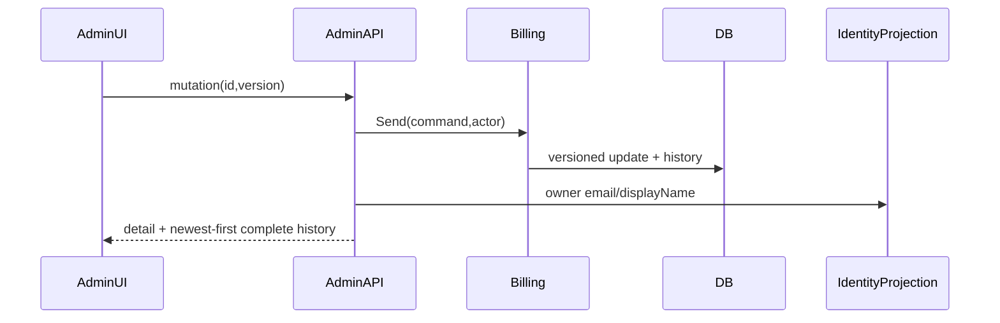

# Design: Jade Trader OS Core Portals — Wave 0

## Approach and Current Evidence

Extend the modular monolith with Identity recovery and Billing-owned subscriptions through subscription-only Admin API/UI. **EXISTING:** `User` lockout, `LoginHandler` dummy verification, rotating refresh tokens, Minimal API/MediatR, Host DI, and Angular standalone Signals/OnPush routes. Billing/Admin are scaffolds; Admin UI is unwired. PublicPortal/Trading remain unchanged.

## Decisions and Domain Model

| Decision | Choice / rationale |
|---|---|
| Recovery proof | Temporary login marks the verifier used (single-use) while activating a server grant. Restricted JWT claims: `scope=password_change`, generation, `grant_jti`, `exp`; no refresh. Change validates JWT+grant, then consumes grant, preventing replay. |
| Expiry | Server stores `expires_at=activated_at+24h`; login and change both compare `IClock.UtcNow`. JWT `exp` cannot exceed it. UI deadline is display-only. |
| Email | Direct MailKit; no outbox/plaintext persistence. Reserve a pending generation without replacing active state, send, then CAS-activate if still latest pending. Failure preserves prior active credential; CAS-losing email is unusable. Activation accepts only `Generation == latestGeneration` — both older and newer mismatches fail as superseded. A unique partial index `(user_id) WHERE status='Activated'` enforces "exactly one active" at the DB level. |
| Reuse detection | Lives in the Application boundary (`PasswordChangeReuseChecker`) using `IPasswordHasher.Verify`. The domain stores salted PBKDF2 hashes and cannot detect reuse by hash string comparison — the same plaintext produces a different encoded hash on every call. |
| Ownership | Identity owns credentials/session version; Billing owns plans/subscriptions/history; Admin authorizes, delegates, and composes a minimal owner projection. |

**NEW Identity:** `TemporaryCredential`, `PasswordHistoryEntry`, `PasswordHash`, `User.SessionVersion`; activation/grant/change/revocation events. Invariants: 128-bit 26-character Crockford credential (16-byte CSPRNG seed, 26 base-32 chars); latest activated only (`Generation == latestGeneration`); temporary failures share lockout; reject current plus previous five (via Application `PasswordChangeReuseChecker`); history `(changed_at DESC, id DESC)` retains five prior hashes (backing list normalized before prepend/evict to defend against hydration order). Recovery change accepts `{newPassword}` because grant proves current credential; **NEW** voluntary endpoint accepts `{currentPassword,newPassword}`.

**NEW Billing model:** `Plan`, `Subscription` aggregate, `PlanCode`/`SubscriptionPeriod` VOs; events `SubscriptionTierChanged/Cancelled/TrialExtended`. Eligible-plan, cancellable-state, active-trial/future-date, no-op, and optimistic-version invariants apply; each commit appends prior/result/action/actor/time/version history.

## Storage, Concurrency, and Retention

`0006` **NEW**: `temporary_credentials` with `UNIQUE(user_id, generation)`, partial-unique `(user_id) WHERE status='Activated'` (latest-only persistence foundation), expiry/grant/active indexes; ordered `password_history` on `(user_id, changed_at DESC, id DESC)`; `users.session_version`. Purge consumed/expired rows after seven days and history beyond five. Login/change lock the row. Change atomically normalizes the backing history list (so hydration order cannot evict the wrong hash), updates password/history, consumes grant, increments session version, revokes refresh tokens, and issues one unrestricted pair; conflict has no partial writes. Slice 0b supersedes older `Activated` rows inside the same DB transaction that reserves a new `Pending` row.

`0007` **NEW**: `billing.plans(code UNIQUE)`, `subscriptions` with unique user, `(status,updated_at DESC)`, version; append-only `subscription_history(subscription_id,occurred_at DESC,id DESC)`, retained indefinitely for audit.

## Sequences

```mermaid
sequenceDiagram
 UI->>API: forgot(email)
 API->>DB: reserve generation
 API->>SMTP: bounded send
 API->>DB: CAS activate hash
 API-->>UI: always 200 generic
 UI->>API: login(temp)
 API->>DB: mark verifier used + grant jti
 API-->>UI: restricted JWT, no refresh
 UI->>API: change {newPassword}+JWT
 API->>DB: validate expiry/gen/jti; change+consume+revoke atomically
 API-->>UI: unrestricted token pair
```



## Contracts, Security, Email, and UI

- **NEW** `POST /api/auth/forgot-password {email}` → always `200 {accepted:true}`; 5/hour/IP. All paths share 14s±250ms and dummy PBKDF2.
- **NEW** recovery change above; errors use RFC7807 `{code,traceId}`: safe `400`, `401 auth.recovery_invalid`, `409 auth.password_reused|concurrent_update`. Middleware checks scope, generation, grant, expiry, and session version before behavior; restricted identities may call only change/logout.
- MailKit: 4s timeout, initial plus two retries, 250/750ms jitter, 13s budget. Terminal failure activates nothing. Log correlation/outcome/attempt/latency and keyed pseudonym only—never body/credential/token/hash.
- **NEW** Admin contracts: list/search; detail returning subscription, plan, `owner:{email,displayName}`, and complete stable newest-first `history[]`; tier/cancel/extend requests include version. **NEW** `IUserOwnerProjection` in Identity.Contracts is read-only and exposes only those two fields—no user-admin route or mutation.
- Angular **EXISTING** `AuthState`, `authGuard`, `app.routes.ts`, Admin placeholder are extended. **NEW** forgot/forced-change pages, recovery guard/state fields, `adminGuard`, Admin API/state, list/detail/history pages; strict TS, standalone, Signals, OnPush, SCSS, accessible loading/error/empty/conflict states. Host **EXISTING** `Program.cs` adds Billing DI/MediatR/validators, `AdminOnly`, restricted-token validation, Mail options, and endpoint maps. Direction: Host → Admin API → Billing Application/Contracts → Domain; Infrastructure → Application. PublicPortal is untouched.

## Testing, Delivery, and Rollout

RED tests cover expiry after login, verifier/grant replay, five-attempt lockout (via the shared `User.RecordFailedLogin` boundary exercised by both paths), salted-hash reuse detection at the Application boundary, hydration-order defense, session revocation, uniform timing/body, SMTP retry/failure/no activation, reset races/latest activation, Admin denial-before-lookup, Billing transitions/concurrency/history ordering, projection narrowing, Angular guards/state/accessibility, and PublicPortal/Trader regressions. Threat matrix: all documentation-path, Git, commit, push, and PR-command rows are **N/A**; no executable classification, shell/subprocess, VCS, or PR automation changes.

| Slice | Exact boundary | Forecast |
|---|---|---:|
| 0a | Identity credential/history model, `0006`, domain tests + Application reuse checker | 360 |
| 0b | Recovery issuance/login/change handlers and application tests | 332 |
| 0c | MailKit/Mailpit/in-memory transport, API/Host DI, integration tests/config | 286 |
| 0d | Angular recovery state/guards/pages/tests | 344 |
| 0e | Billing aggregate/storage/`0007` and domain tests | 356 |
| 0f | Billing handlers/contracts, Admin API/owner projection/Host/authz tests | 338 |
| 0g | Angular Admin list/detail/history/state/routes/tests | 371 |

Feature Branch Chain order is 0a→0g. The proposed five slices are split because transport and Billing/Admin composition cannot credibly carry implementation plus tests below 400; forecasts include authored tests/config/docs and exclude generated output. Diff count is checked before each PR and split again rather than exceeded. Apply additive migrations, configure SMTP, deploy recovery, then Billing/Admin and seed plans. Rollback unmaps routes/DI and retains inert credential/commercial audit data. No Stripe, general user administration, PublicPortal pricing rewrite, Trader rewrite, or later-wave features.
